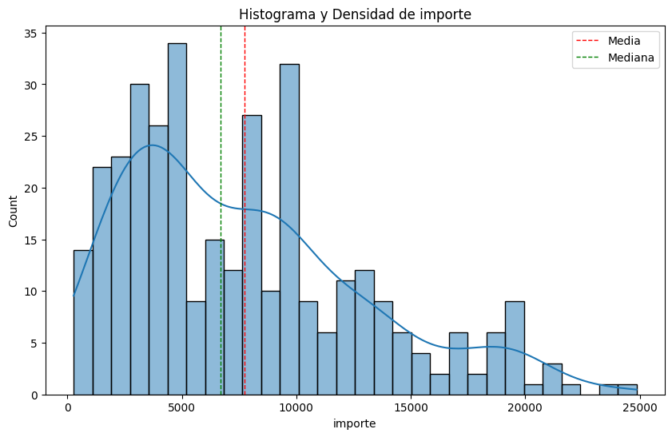
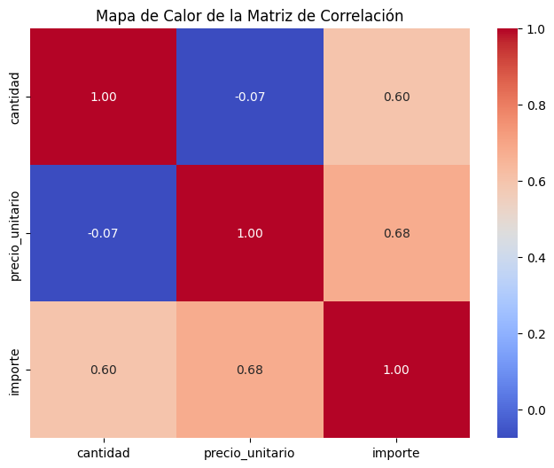
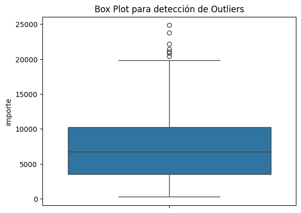

# Tema

**Generar la Documentación Tecnica Para ver cual es la Estructura de la base de Datos, Tipos de datos y tablas Principales. Para crear un Menu interactivo para Tienda tipo Minimarket (Tienda Aurelion)**

---

2. ## Problema

**Tienda Aurelion no tiene soluciones tecnologicas para poder visualizar su documentación.**

---

3. ## Solución

**Armado de Documentación Técnica y creación de chatbot intectativo para visualizar las diferentes opciones de la documentación**

---

4. ## Estructura de la Base de Datos

## Fuente

Bases de Datos suministradas por Tienda Aurelion

## Tipo de Base de Datos

Base de datos Relacional

## Tipo de Datos

Datos Estructurados

## Tipo de los datos de campo:

id_venta, id_producto: Numérico/Entero
nombre_producto: Texto/Cadena.
cantidad: Numérico/Entero.
precio_unitario, importe: Numérico/Moneda

### Tablas Principales

| Tabla               | Campos                                                              |
| ------------------- | ------------------------------------------------------------------- |
| **Clientes**        | Id, Nombre, Email, Ciudad, Fecha de alta                            |
| **Detalles Ventas** | Id de la venta, Id del producto, Cantidad, Precio unitario, Importe |
| **Productos**       | Id del producto, Nombre del producto, Categoría, Precio unitario    |
| **Ventas**          | Id, Fecha, Id del cliente, Nombre del cliente, Email, Medio de pago |

---

### Cantidad de Registros

- **Ventas:** 120 registros
- **Detalles Ventas:** 120 registros
- **Productos:** 100 productos registrados
- **Clientes:** 100 registros de clientes

---

## Escala de Medición

- **Nominal:** El tipo de producto está en una categoría sin orden.
- **Intervalo:** Fechas de las ventas y altas de clientes.
- **Razón:** Ingresos y cantidad de ventas.

---

5. ## Instrucciones

6. ## Pseudocódigo

```plaintext
FUNCIÓN iniciar_chatbot():
    LLAMAR mostrar_menu()

    // Bucle principal del chatbot
    MIENTRAS VERDADERO:
        // Solicitar entrada al usuario
        ENTRADA = LEER ENTRADA DE USUARIO (Convertir a MAYÚSCULAS y eliminar espacios)

        // Evaluar la entrada
        SI ENTRADA ES IGUAL A "S":
            IMPRIMIR "¡Gracias por usar el Chatbot!"
            SALIR DEL PROGRAMA (sys.exit)

        SINO SI ENTRADA ES IGUAL A "M":
            LLAMAR mostrar_menu()

        SINO SI ENTRADA EXISTE EN LAS CLAVES DE DOCUMENTACION:
            PASO = DOCUMENTACION[ENTRADA]

            // Imprimir el Título del Paso
            IMPRIMIR "PASO " + ENTRADA + ": " + PASO.titulo

            // Imprimir el Contenido del Paso
            // Nota: Aquí, si el paso es "4", ya se habrá llamado a formato_tablas_principales()
            // al definir el diccionario.
            IMPRIMIR PASO.contenido
            IMPRIMIR "--- Fin del contenido del paso ---"

        SINO:
            IMPRIMIR "❌ Opción no válida. Intenta de nuevo."
FIN FUNCIÓN
```

Nota: el Spseudocodigo tambien lo puede encontrar el archivo
[Pseudocodigo](/pseudocodigo.ipynb)

7. ## Diagrama de Flujo


---

<!-- Documentación generada automáticamente: recorrido de notebooks -->

---

# Recorrido y Documentación de notebooks

Fecha ejecución: 2025-11-08 11:22:59

## Notebook: estadisticas_basicas.ipynb

- Ruta: `C:\Users\marti\OneDrive\Desktop\Katiuska_Martinez_Proyecto_Aurelion\estadisticas_basicas.ipynb`

- Celdas totales: 2

- Celdas de código: 2 | Celdas markdown: 0

### Resumen por celda (pasos y resultados detectados)

- CODE 1: acciones detectadas: ['Carga de datos (lectura de archivo)', 'Limpieza / tratamiento de valores faltantes/duplicados', 'Detección/estadística de outliers']

  - Extracto de código:

```python

import pandas as pd

# --- 1. Carga de datos desde archivo Excel (.xlsx) ---
try:
    detalle_ventas = pd.read_excel('Assets/detalle_ventas.xlsx')
    print("✅ Datos cargados exitosamente desde detalle_ventas.xlsx")
...

```

- Salida textual (extracto):

```

✅ Datos cargados exitosamente desde detalle_ventas.xlsx

📊 **Estadísticas Descriptivas de Ventas**
------------------------------------------

📈 **Columna: CANTIDAD**
  **Media (Promedio):** 2.96
  **Mediana (Valor Central):** 3.00
  **Moda(s) (Más Frecuente):** 2
  **Desviación Estándar (Std):** 1.37

📈 **Columna: IMPORTE**
  **Media (Promedio):** 7730.08
  **Mediana (Valor Central):** 6702.00
  **Moda(s) (Más Frecuente):** 4435, 4752
  **Desviación Estándar (Std):** 5265.54

```

- CODE 2: acciones detectadas: ['Carga de datos (lectura de archivo)']

  - Extracto de código:

```python

df = pd.read_excel("Assets/clientes.xlsx")
# 1. Contar el número de clientes en cada ciudad
conteo_clientes_por_ciudad = df['ciudad'].value_counts()
print("Clientes por Ciudad:\n", conteo_clientes_por_ciudad)

# 2. (Opcional) Mostrar el porcentaje de clientes por ciudad
...

```

- Salida textual (extracto):

```

Clientes por Ciudad:
 ciudad
Rio Cuarto     23
Alta Gracia    21
Carlos Paz     15
Villa Maria    15
Cordoba        13
Mendiolaza     13
Name: count, dtype: int64

Porcentaje de Clientes por Ciudad:
 ciudad
Rio Cuarto     23.0
Alta Gracia    21.0
Carlos Paz     15.0
Villa Maria    15.0
Cordoba        13.0
Mendiolaza     13.0
Name: proportion, dtype: float64

```

### Conclusión rápida (heurística)

- Acciones detectadas en el notebook: ['Carga de datos (lectura de archivo)', 'Limpieza / tratamiento de valores faltantes/duplicados', 'Detección/estadística de outliers']

## Notebook: tipo_distribucion.ipynb

- Ruta: `C:\Users\marti\OneDrive\Desktop\Katiuska_Martinez_Proyecto_Aurelion\tipo_distribucion.ipynb`

- Celdas totales: 1

- Celdas de código: 1 | Celdas markdown: 0

### Resumen por celda (pasos y resultados detectados)

- CODE 1: acciones detectadas: ['Carga de datos (lectura de archivo)', 'Generación de visualizaciones', 'Detección/estadística de outliers']

  - Extracto de código:

```python

import pandas as pd
import numpy as np
import matplotlib.pyplot as plt
import seaborn as sns

# archivo .xlsx
...

```

- Salidas gráficas guardadas (1):

  - 

- Salida textual (extracto):

```

Media de 'importe': 7730.08
Mediana de 'importe': 6702.00
Asimetría (Skewness): 0.87
-> Distribución con Asimetría Positiva (Sesgada a la Derecha, ej. Ingresos).
<Figure size 1000x600 with 1 Axes>

```

### Conclusión rápida (heurística)

- Acciones detectadas en el notebook: ['Carga de datos (lectura de archivo)', 'Generación de visualizaciones', 'Detección/estadística de outliers']

- Imágenes extraídas y guardadas en: `figuras_notebooks\tipo_distribucion`

## Notebook: correlacion_entre_variables.ipynb

- Ruta: `C:\Users\marti\OneDrive\Desktop\Katiuska_Martinez_Proyecto_Aurelion\correlacion_entre_variables.ipynb`

- Celdas totales: 5

- Celdas de código: 5 | Celdas markdown: 0

### Resumen por celda (pasos y resultados detectados)

- CODE 1: acciones detectadas: ['Carga de datos (lectura de archivo)']

  - Extracto de código:

```python

import pandas as pd
# archivo .xlsx
df = pd.read_excel('Assets/detalle_ventas.xlsx', engine='openpyxl')

```

- CODE 2: acciones detectadas: ['Cálculo de correlación / modelo simple']

  - Extracto de código:

```python

# Mide la correlación de Pearson entre la Cantidad y el Importe
correlacion_cant_importe = df['cantidad'].corr(df['importe'])
print(f"Correlación entre Cantidad e Importe: {correlacion_cant_importe:.3f}")

```

- Salida textual (extracto):

```

Correlación entre Cantidad e Importe: 0.600

```

- CODE 3: acciones detectadas: ['Generación de visualizaciones']

  - Extracto de código:

```python

import matplotlib.pyplot as plt

columna_analizar = 'importe' # O la columna que elijas (cantidad, precio_unitario, etimport scipy.stats as statsc.)

plt.figure(figsize=(8, 6))
stats.probplot(df[columna_analizar], dist="norm", plot=plt)
...

```

- Salidas gráficas guardadas (1):

  - 

- Salida textual (extracto):

```

<Figure size 800x600 with 1 Axes>

```

- CODE 4: acciones detectadas: ['Cálculo de correlación / modelo simple']

  - Extracto de código:

```python

# Calcula la matriz de correlación para todas las columnas numéricas
matriz_correlacion = df[['cantidad', 'precio_unitario', 'importe']].corr()
print("Matriz de Correlación:\n", matriz_correlacion)

```

- Salida textual (extracto):

```

Matriz de Correlación:
                  cantidad  precio_unitario   importe
cantidad         1.000000        -0.074483  0.599723
precio_unitario -0.074483         1.000000  0.679298
importe          0.599723         0.679298  1.000000

```

- CODE 5: acciones detectadas: ['Generación de visualizaciones', 'Cálculo de correlación / modelo simple']

  - Extracto de código:

```python

#Visualización de la Correlación (Mapa de Calor)
import seaborn as sns
import matplotlib.pyplot as plt

# 1. Calcular la matriz de correlación
matriz_correlacion = df[['cantidad', 'precio_unitario', 'importe']].corr()
...

```

- Salidas gráficas guardadas (1):

  - 

- Salida textual (extracto):

```

<Figure size 800x600 with 2 Axes>

```

### Conclusión rápida (heurística)

- Acciones detectadas en el notebook: ['Carga de datos (lectura de archivo)', 'Cálculo de correlación / modelo simple', 'Generación de visualizaciones']

- Imágenes extraídas y guardadas en: `figuras_notebooks\correlacion_entre_variables`

## Notebook: analizar_outliers.ipynb

- Ruta: `C:\Users\marti\OneDrive\Desktop\Katiuska_Martinez_Proyecto_Aurelion\analizar_outliers.ipynb`

- Celdas totales: 3

- Celdas de código: 3 | Celdas markdown: 0

### Resumen por celda (pasos y resultados detectados)

- CODE 1: acciones detectadas: ['Carga de datos (lectura de archivo)', 'Generación de visualizaciones']

  - Extracto de código:

```python

import seaborn as sns
import matplotlib.pyplot as plt
import pandas as pd

# archivo .xlsx
df = pd.read_excel('Assets/detalle_ventas.xlsx')
...

```

- Salidas gráficas guardadas (1):

  - 

- Salida textual (extracto):

```

<Figure size 640x480 with 1 Axes>

```

- CODE 2: acciones detectadas: ['Detección/estadística de outliers']

  - Extracto de código:

```python

Q1 = df['precio_unitario'].quantile(0.25)
Q3 = df['importe'].quantile(0.75)
IQR = Q3 - Q1

limite_inferior = Q1 - 1.5 * IQR
limite_superior = Q3 + 1.5 * IQR
...

```

- Salida textual (extracto):

```

Valores Atípicos Encontrados (Outliers):
      id_venta  id_producto        nombre_producto  cantidad  precio_unitario  \
141        50           58  Caramelos Masticables         5             4752
208        75            2             Pepsi 1.5L         5             4973

     importe
141    23760
208    24865

```

## Valores Atípicos Encontrados (Outliers)

| id_venta | id_producto | nombre_producto       | cantidad | precio_unitario | importe |
| -------: | ----------: | --------------------- | -------: | --------------: | ------: |
|       50 |          58 | Caramelos Masticables |        5 |            4752 |   23760 |
|       75 |           2 | Pepsi 1.5L            |        5 |            4973 |   24865 |

- CODE 3: acciones detectadas: ['Carga de datos (lectura de archivo)', 'Limpieza / tratamiento de valores faltantes/duplicados', 'Agregación / resumen por grupos', 'Detección/estadística de outliers']

  - Extracto de código:

```python

import pandas as pd
import numpy as np

# --- 1. Carga de datos desde archivo Excel (.xlsx) ---
archivo_excel = 'Assets/productos_corregidos.xlsx'

...

```

### Conclusión rápida (heurística)

- Acciones detectadas en el notebook: ['Carga de datos (lectura de archivo)', 'Generación de visualizaciones', 'Detección/estadística de outliers', 'Limpieza / tratamiento de valores faltantes/duplicados', 'Agregación / resumen por grupos']

- Imágenes extraídas y guardadas en: `figuras_notebooks\analizar_outliers`

## Notebook: interpretar_resultados.ipynb

- Ruta: `C:\Users\marti\OneDrive\Desktop\Katiuska_Martinez_Proyecto_Aurelion\interpretar_resultados.ipynb`

- Celdas totales: 1

- Celdas de código: 0 | Celdas markdown: 1

### Resumen por celda (pasos y resultados detectados)

- MD 1: # Punto 5 — Interpretación de resultados

### Conclusión rápida (heurística)

- No se detectaron acciones relevantes automáticamente.

### Diseño conceptual ML

se enfocaría en predecir el comportamiento futuro de las ventas o identificar clientes clave.

## Define el objetivo (predecir o clasificar)🎯

El objetivo principal debe ser la predicción, ya que el análisis previo involucró variables numéricas clave como importe y cantidad.

Objetivo Elegido: Predecir (Regresión)

Meta Específica: Predecir el Importe Total de Venta (importe) para la siguiente semana o mes, basado en factores como la cantidad de productos vendidos y el precio_unitario.

Justificación: Esto proporciona una estimación directa de los ingresos futuros, lo que es vital para la gestión de inventario, finanzas y planeación.

## Elige y justifica el algoritmo 🧠

Dado que el objetivo es la predicción de una variable numérica continua (importe), se justifica un algoritmo de Regresión.

Algoritmo Elegido: Regresión Lineal / alternativa Regresión de Bosque Aleatorio (Random Forest Regressor)

| Algoritmo                                    | Justificación                                                                                                                                                                                                                                                                                                       |
| -------------------------------------------- | ------------------------------------------------------------------------------------------------------------------------------------------------------------------------------------------------------------------------------------------------------------------------------------------------------------------- |
| Regresión Lineal                             | Regresión Lineal (si la relación es muy lineal) o Gradient Boosting (más preciso pero más complejo y con mayor riesgo de sobreajuste).                                                                                                                                                                              |
| Alternativa Bosque Aleatorio (Random Forest) | Es robusto contra el sobreajuste y maneja bien la no linealidad y la dispersión (outliers) observadas en los datos de ventas (importe vs. cantidad). Además proporciona una importancia de características clara, permitiendo identificar qué factor (precio, cantidad, categoría) impacta más en el importe final. |

## Indica entradas (X) y salida (y) ➡️

El modelo utilizaría los datos de las tablas principales (Ventas, Detalles Ventas, Productos) para hacer la predicción.

Salida (y) - Variable a Predecir
y: Importe (Valor total de la venta o transacción).

Entradas (X) - Variables Predictoras (Features)
Las variables deben ser seleccionadas de las tablas Detalles Ventas y Productos (previamente codificadas si son categóricas).

| Tabla de Origen | Variable (Feature) | Tipo de Dato    | Observaciones                                                                  |
| --------------: | ------------------ | --------------- | ------------------------------------------------------------------------------ |
| Detalles Ventas | cantidad           | Numérico/Entero | Variable clave que muestra una correlación fuerte.                             |
| Detalles Ventas | precio_unitario    | Numérico/Moneda | El valor del producto es esencial en la predicción del importe.                |
|       Productos | categoría          | Categórico      | Debería ser codificada (ej. One-Hot Encoding) para ser utilizada en el modelo. |
|          Ventas | medio_de_pago      | Categórico      | Podría influir en el comportamiento del cliente (ej. crédito vs. efectivo).    |

## Especificación de Métricas de evaluación 📏

Para evaluar un modelo de Regresión (predicción de valores continuos), se utilizan métricas que cuantifican la diferencia promedio entre el valor real y el valor predicho.

📉 Error Promedio (Formalizado)
El término general "Error Promedio" se descompone en MAE y RMSE para ser utilizado en regresión:

| Métrica                        | Descripción                                                                                                                                     | Fórmula                                                                                |
| ------------------------------ | ----------------------------------------------------------------------------------------------------------------------------------------------- | -------------------------------------------------------------------------------------- |
| RMSE (Root Mean Squared Error) | Mide la magnitud promedio de los errores del modelo. La unidad está en la misma escala que la variable y (importe).                             | $\mathrm{RMSE} = \sqrt{\dfrac{1}{n}\sum_{i=1}^{n}(y_i - \hat{y}_i)^2}$                 |
| MAE (Mean Absolute Error)      | Mide el promedio de las diferencias absolutas entre las predicciones y los valores reales. Es más robusto a los outliers que el RMSE.           | $\mathrm{MAE} = \dfrac{1}{n}\sum_{i=1}^{n}\lvert y_i - \hat{y}_i\rvert$                |
| R Cuadrado ($R^2$)             | Mide la proporción de la varianza en la variable dependiente (importe) que es explicada por las variables independientes. Cercano a 1 es mejor. | $R^2 = 1 - \dfrac{\sum_{i=1}^{n}(y_i - \hat{y}_i)^2}{\sum_{i=1}^{n}(y_i - \bar{y})^2}$ |

## Análisis del gráfico: Importe Real vs Importe Predicho

Resumen

- Gráfico: scatter Importe real (eje X) vs Importe predicho (eje Y) con línea y = x (predicción perfecta).
- Interpretación: los puntos deberían alinearse sobre la línea. La dispersión vertical indica error de predicción.

Observaciones clave

- Sesgo: si la nube está mayoritariamente por debajo de la línea → subestimación; por encima → sobreestimación.
- Heteroscedasticidad: dispersión creciente con el importe real sugiere errores proporcionales al valor (considerar transformación log).
- Outliers: puntos alejados de la línea requieren inspección (errores de ingreso o ventas extraordinarias).

Métricas (reemplazar con valores reales tras ejecución)

- MAE: <$1191.23>
- RMSE: <$1643.93>
- R²: <0.843>

Implicaciones

- Dispersión alta → mejorar features, usar modelos no lineales (Random Forest / Gradient Boosting) o transformar target.
- Outliers frecuentes → revisar y decidir excluir, corregir o modelar con métodos robustos.

Recomendaciones prácticas

1. Calcular residuales y graficar Residuales vs Predicho (buscar patrón).
2. Evaluar distribución de residuales (histograma / QQplot).
3. Probar log(importe) si hay heteroscedasticidad.
4. Probar modelos no lineales y comparar con CV (MAE/RMSE).
5. Revisar registros atípicos manualmente (corregir o anotar).

## 📄 Documentación del Proyecto Power BI: Tienda Aurelion

Fecha: 13 de diciembre de 2025 Analista: Katiuska Marinez Propósito: Documentar el Modelo de Datos, las Medidas Clave (KPIs) y las Metodologías de Análisis aplicadas al reporte de la Tienda Aurelion.

1. ⚙️ Modelo de Datos y Origen
   El reporte está construido sobre un modelo de estrella optimizado que centraliza la inteligencia de negocio.

| Tabla |  
Tipo |
Descripción |
Clave |
| :----------------------------------------- | :-------------: | ----------: | ----------- | --------- | --------------------------------------------------------- |
| FactVentas | Tabla de Hechos |
| Contiene todas las transacciones de venta. | id_venta | | DimClientes | Dimensión | Información detallada de los clientes (Ciudad, ID, etc.). | id_cliente | | DimProductos | Dimensión | Datos de los productos (Categoría, Nombre, Precio Unitario). | id_producto | | DimCalendario | Dimensión | Contiene una fila por día para análisis de tiempo continuo. | Date |

Relaciones Clave: Las dimensiones filtran las tablas de hechos (1:\* Cardinalidad, Relación Única Activa).

2. 📊 Métricas y KPIs Fundamentales
   Las medidas han sido agrupadas en la tabla \_Medidas Clave para facilitar la gestión.

A. Rendimiento de Venta y Precio (KPI 3)

Medida,DAX,Propósito
Ventas Totales,SUM(FactVentas[importe]),Ingreso bruto total.
Ventas Totales Continuas,"COALESCE([Ventas Totales], 0)",Asegura una serie temporal ininterrumpida para el análisis de tendencias.
Precio Promedio x Unidad,"DIVIDE([Ventas Totales], [Cantidad Vendida], 0)",Precio de venta promedio real por unidad.
Umbral Precio Promedio,3000,Meta fija para el valor promedio deseado.

B. Actividad del Cliente y Frecuencia (KPI 2)MedidaDAXPropósitoConteo TransaccionesDISTINCTCOUNT(FactVentas[id_venta])Número total de ventas únicas.Meta Frecuencia100Objetivo de transacciones únicas (se asume mensual por defecto).Clientes Totales ActivosDISTINCTCOUNT(FactVentas[id_cliente])Denominador para el cálculo de recurrencia.

C. Lealtad y RecurrenciaMedidaDAXPropósitoClientes Recurrentes(Ver Sección 4.1)Cuenta clientes con más de una transacción única en el período.% Clientes RecurrentesDIVIDE([Clientes Recurrentes], [Clientes Totales Activos], 0)KPI que mide la lealtad (retención).Meta % Recurrencia0.30Objetivo fijo de retención (30%).

3. 📈 Diseño y Visualizaciones ClaveVisualizaciónDescripción y UsoTipo de GráficoKPI 2 & 3Mide el rendimiento ([Precio Promedio]) y la actividad ([Conteo Transacciones]) frente a metas fijas (3000 y 100).Visual KPI DedicadoTendencia de Ventas por CategoríaMuestra el Ingreso Total y la composición proporcional de cada categoría a lo largo del tiempo.Gráfico de Área ApiladaConcentración de ClientesIdentifica las ciudades con la mayor base instalada de clientes.Gráfico de Barras AgrupadasEvolución del Medio de PagoMuestra la variación porcentual de los métodos de pago (efectivo, tarjeta) en el tiempo, clave para el análisis de costos.Gráfico de Área Apilada 100%Análisis de OutliersGráfico clave para el diagnóstico del modelo de regresión. Muestra las transacciones atípicas (altos errores) en la variable importe.Gráfico de Dispersión

4. 🧮 Lógica DAX Avanzada y Diagnóstico
   4.1. Lógica de Clientes Recurrentes
   La medida [Clientes Recurrentes] utiliza una iteración para contar clientes que han comprado más de una vez.

Clientes Recurrentes =
COUNTROWS(
FILTER(
VALUES(FactVentas[id_cliente]),
-- Calcula el conteo de transacciones para cada cliente en el contexto de filtro
CALCULATE(DISTINCTCOUNT(FactVentas[id_venta])) > 1
)
)

4.2. Análisis de Continuidad de Fecha
Todos los visuales de tendencia usan la columna DimCalendario[Date] configurada como Fecha Continua en los ejes. Esto garantiza que la tendencia, la recurrencia y los KPIs de tiempo no se vean afectados por brechas en los datos de venta.

4.3. Identificación de Outliers (Gráfico de Dispersión)
Para visualizar el detalle (y no la suma) de cada transacción:

Se usó el campo detalle_ventas[id_venta] en la sección Detalles (Details).

Los campos detalle_ventas[precio_unitario] (Eje X) y detalle_ventas[importe] (Eje Y) se configuraron con la opción "No resumir" (Do not summarize).

Esto permite que cada punto en el gráfico represente una transacción individual, facilitando la identificación visual de las ventas atípicas (puntos alejados de la tendencia de regresión).
